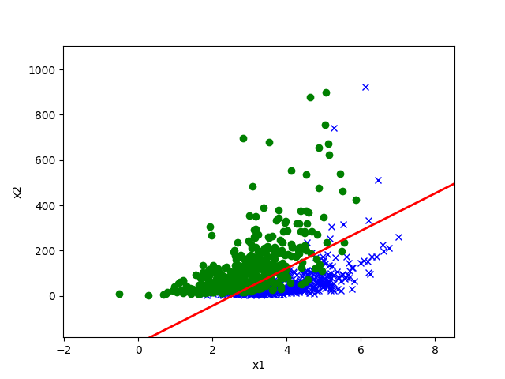

# Experiment Report

## Introduction

This assignment (based on [CS229 2018 Autumn Problem Set 1](https://github.com/maxim5/cs229-2018-autumn/tree/main/problem-sets-solutions/PS1))
analyzes **logistic regression** and **Gaussian discriminant analysis (GDA)** as two
linear binary classifiers — one discriminative, one generative. It covers the convexity
of the logistic regression loss, a from-scratch Newton's-method implementation, a proof
that GDA yields a linear decision boundary, and the MLE derivation for GDA's parameters.

## Materials and Methods

**(a) Convexity of the logistic regression loss** — derive the Hessian `H` of
`J(θ) = -1/m Σ [y log(h_θ(x)) + (1-y) log(1-h_θ(x))]` and show `zᵀHz ≥ 0` for any vector
`z`, i.e. `H` is positive semi-definite, so `J` is convex with a unique global minimum.

**(b) Logistic regression via Newton's Method** — implemented in [`ML_HW3.ipynb`](ML_HW3.ipynb)
as a `LogisticRegression` class subclassing the `LinearModel` base in
[`linear_model.py`](linear_model.py): starting from `θ=0`, each iteration computes the gradient
`∇J(θ) = 1/m Xᵀ(g(Xθ) - y)` and Hessian `H = 1/m Xᵀ diag(g(Xθ)∘(1-g(Xθ))) X`, then
updates `θ ← θ - H⁻¹∇J(θ)` until `‖θ_k - θ_{k-1}‖₁ < ε` (`ε = 1e-5`). Trained on
`ds1_train.csv`, evaluated on `ds1_valid.csv`.

**(c) GDA produces a linear decision boundary** — starting from the GDA generative
model (`p(y)`, `p(x|y=0)`, `p(x|y=1)` as Gaussians sharing covariance `Σ`), derive the
posterior `p(y=1|x)` via Bayes' rule and show it reduces to the logistic form
`1/(1+exp(-(θᵀx+θ₀)))`, with `θ = Σ⁻¹(μ₁-μ₀)`.

**(d) MLE for GDA's parameters** — for 1-D `x` (so `Σ=[σ²]` is scalar), derive the
maximum-likelihood estimates of `φ, μ₀, μ₁, Σ` by maximizing the log-likelihood
`ℓ(φ,μ₀,μ₁,Σ) = log Π p(x⁽ⁱ⁾,y⁽ⁱ⁾)` and confirm they match the standard closed-form
estimates (sample class frequency for `φ`, per-class sample mean for `μ₀`/`μ₁`, and
pooled sample covariance for `Σ`).

## Results

Part (b)'s Newton's-method logistic regression converges in a handful of iterations and
correctly separates the two classes on `ds1`, as shown below (predictions saved to
[`Output/predictions.txt`](Output/predictions.txt)):

Parts (a), (c), and (d) are closed-form derivations; see the full step-by-step math in
[`ML_HW3.pdf`](ML_HW3.pdf).

## Conclusion

The Hessian of the logistic regression loss is always positive semi-definite, confirming
the loss is convex and Newton's method converges reliably to a global optimum. GDA, despite
being derived from a completely different (generative, Gaussian-based) assumption, produces
the exact same linear-in-`x` logistic form for its posterior as logistic regression itself —
and its closed-form MLEs match the intuitive sample statistics, underscoring how
discriminative and generative linear classifiers can arrive at equivalent decision
boundaries from different starting assumptions.

## Code

You can run on colab or local

[`linear_model.py`](linear_model.py) holds the `LinearModel` base class and [`util.py`](util.py)
the plotting/data-loading helpers the notebook depends on; `ds1_train.csv` /
`ds1_valid.csv` are the training/validation data for part (b).
